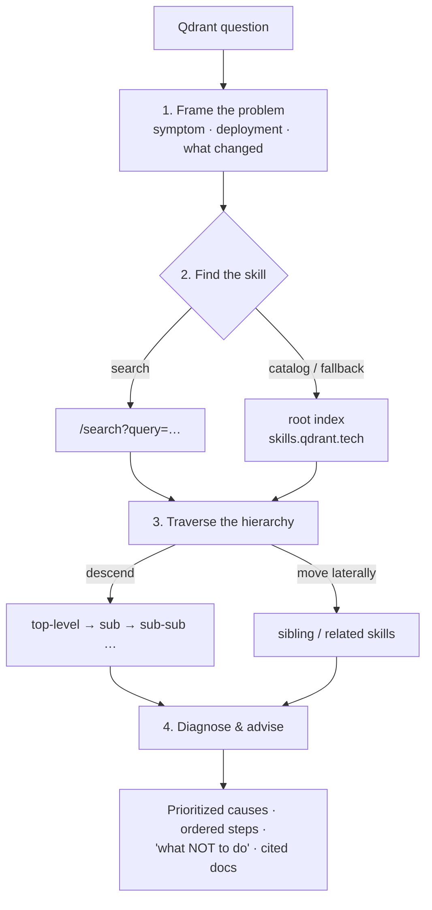

# Qdrant Troubleshooting & Advisory — a Claude Skill

> Diagnose, troubleshoot, and advise on **any** Qdrant deployment by loading the latest official Qdrant skills **live** from [`skills.qdrant.tech`](https://skills.qdrant.tech) — so the guidance is always current and only the relevant context is loaded.


---

## What it does

This is an **orchestrator skill**: it doesn't carry any Qdrant knowledge of its own. When a Qdrant question comes up, it reaches out to the official Qdrant skills registry, finds the right skill(s) for the symptom, walks the hierarchy to the level that actually answers the question, and grounds its diagnosis in what it loaded — citing the canonical docs it used.

Because nothing is baked in, the advice never goes stale: every session pulls the newest version of the registry.

## Why it's different

Most "knowledge" skills freeze a snapshot of documentation into bundled files. Qdrant moves fast — new endpoints, metrics, defaults, and deployment patterns land regularly — so a snapshot is wrong by the time you need it.

This skill takes the opposite approach:

- **No bundled Qdrant content.** The skill is a single `SKILL.md` that describes *how to fetch and navigate* the live registry, not *what Qdrant does*.
- **Always fresh.** It fetches the registry on every use and never reuses a cached copy.
- **Only the relevant context.** It loads just the branch(es) that match the symptom — not the whole tree — keeping answers focused and the context window lean.

## What it covers

The registry exposes top-level skills the orchestrator routes into, including:

| Area | Typical questions |
| --- | --- |
| **Monitoring & observability** | Prometheus/Grafana setup, health checks, `/metrics`, `/telemetry`, optimizer stuck, memory growth, slow requests |
| **Performance optimization** | Search speed, memory usage, indexing performance tuning |
| **Scaling** | Node count, QPS vs latency tradeoffs, sharding, multitenancy, vertical vs horizontal |
| **Search quality** | Irrelevant results, hybrid search, reranking, filtering |
| **Deployment options** | Local, Docker, self-hosted, Qdrant Cloud, embedded |
| **Model migration** | Switching embedding models without downtime |
| **Version upgrades** | Safe upgrade paths, compatibility, rolling upgrades |
| **Client SDKs** | Python, TypeScript, Rust, Go, .NET, Java |

It triggers even when "Qdrant" isn't named explicitly, as long as the context is clearly a Qdrant cluster, collection, or vector-search deployment.

## How it works



1. **Frame the problem** — extract the symptom, deployment type/version, and what recently changed; turn it into 1–3 search phrases.
2. **Find the right skill(s)** — search `https://skills.qdrant.tech/search?query=…` for the fastest match, with the root index as the authoritative catalog and fallback.
3. **Traverse the hierarchy — deep and lateral** — descend through nested `SKILL.md` files to the level with concrete guidance, and hop sideways to sibling skills when a symptom spans areas (e.g. slow queries could be optimizer, performance, *or* scaling). Relative links resolve against the current skill's directory; documentation links are fetched as-is and render as markdown natively.
4. **Diagnose and advise** — give the most likely causes in priority order, concrete ordered steps (endpoints, metrics, thresholds, config), the skill's explicit "what NOT to do" warnings, and citations to the canonical Qdrant docs.

## Installation

This repo contains a single-file skill. You can use the prebuilt `.skill` bundle or the raw folder.

**Claude apps (claude.ai / desktop):** open **Settings → Capabilities → Skills**, choose **Upload skill**, and select `qdrant-troubleshooting.skill`.

**Claude Code / API (filesystem skills):** place the `qdrant-troubleshooting/` folder (the one containing `SKILL.md`) into your skills directory so it's discovered at runtime.

> Skill installation paths occasionally change across Claude surfaces — see the official docs at <https://docs.claude.com> for the current steps.

**Build the bundle yourself** (optional) — zip the skill folder so the archive contains `qdrant-troubleshooting/SKILL.md` at its root:

```bash
zip -r qdrant-troubleshooting.skill qdrant-troubleshooting
```

## Usage

Once installed, the skill triggers automatically on relevant prompts. Examples:

- "Our Qdrant node's RAM keeps climbing and it OOM-killed last night."
- "Search got slow right after a big bulk upload — what's going on?"
- "We're at ~80M vectors on one node and latency is creeping up — shard or scale vertically?"
- "How do I set up Prometheus + Grafana monitoring for Qdrant on Hybrid Cloud?"
- "Results from my hybrid search feel irrelevant — how do I improve ranking?"
- "Safest path to upgrade our self-hosted cluster two minor versions?"

## Worked example

**Prompt:** *"Our Qdrant node's RAM keeps climbing all day and it OOM-killed last night. Nothing obvious changed."*

1. **Frame** — steadily growing memory + OOM, no known config change → monitoring/debugging.
2. **Find** — search `…/search?query=qdrant+memory+growing+OOM` (or pick `qdrant-monitoring` from the catalog).
3. **Traverse** — `qdrant-monitoring` → *Debugging with Metrics* → the *Memory Seems Too High* section; hop **laterally** to `qdrant-scaling` to check whether the node is simply undersized.
4. **Advise** — separate resident memory (RSSAnon) from OS page cache (page cache filling RAM is normal, not a leak); investigate only if RSSAnon exceeds ~80% of RAM; check `/telemetry` per collection; estimate expected memory (`num_vectors × dimensions × 4 bytes × 1.5` + payload/index overhead); check common culprits (quantized vectors with `always_ram=true`, too many payload indexes, large `max_segment_size`); reconcile the "leak/misconfig" view against the "under-provisioned" view; cite the memory-consumption and capacity-planning docs.

## Repository structure

```
qdrant-troubleshooting/
└── SKILL.md          # the entire skill: routing + traversal instructions, no bundled Qdrant content
qdrant-troubleshooting.skill   # prebuilt, installable bundle
README.md
```

## Design notes

- **Single source of truth.** All Qdrant knowledge stays in the official registry; this skill only knows how to navigate it.
- **Loads context, doesn't install.** The remote Qdrant skills are *read* as context — nothing from the registry is installed.
- **Graceful fallback.** If a constructed search-query URL is ever rejected, it falls back to the root index, whose links are absolute and always fetchable.

## Contributing

Issues and PRs welcome. Because the skill is just navigation logic, most improvements are about routing heuristics (when to search vs. browse, when to go deep vs. lateral) and trigger-description tuning. Please keep the "no bundled Qdrant content" principle intact — anything that hard-codes Qdrant specifics defeats the always-fresh design.

## License

Released under the MIT License. Replace this section with your preferred license if different.

---

Not affiliated with or endorsed by Qdrant; it consumes the publicly available Qdrant skills registry.
